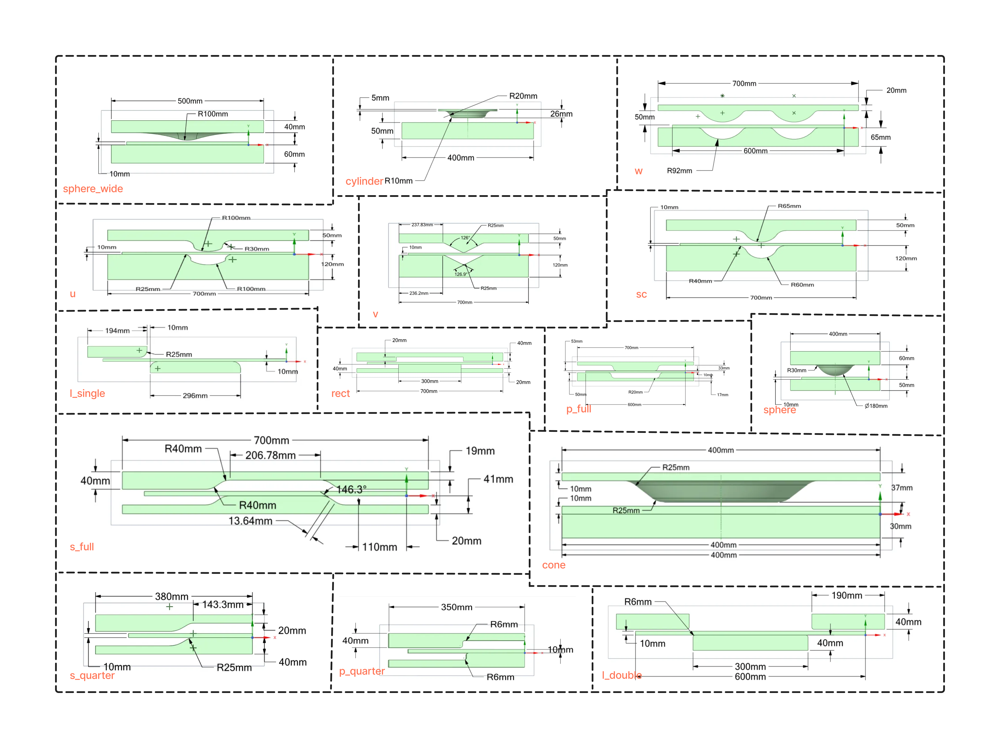

# PressNet

This repo contains/will contain PressNet data and required tools/scripts to use it along with benchmarking code on different surrogate AI models and documents and tutorials related to dataset from generating similar data to exploting the data to its fullest.

## Current Progress
- [x] demo 400 steps structural simulations with coarse mesh
- [x] demo 1500 steps structural simulation with coarse mesh
- [ ] demo 1500 steps structural simulation with medium mesh
- [ ] demo 1500 steps structural simulation with fine mesh
- [ ] surrogateAI
- [ ] tutorial generating raw data

## PressNet Dataset
The dataset compromises of structural deformation simulation with deformation and stress output for a plate under press forming between two dies. Simulation for 15 different die shapes has been provided and each die shape has 10 variation of their own based on various geometric parameters, making total 150 smulations. Each simulation results will be provided for 1500 time steps, while the simulation it self is of 15 seconds, making individual time step of 0.01s. All the simulation additional is provided with three variations in mesh size, namely coarse, medium and fine. Additionaly, we have also provided the same 150 simulation for 400 time steps and coarse mesh, which was generated for testing purpose.

*Figure: Front view of various die shapes used for the simulation*

## Example Inference 
For proof of concept we have trained for the s_quarter die shape using graph network architecture and obtained the following inference. For this particular case we have also generated thermal data and taught the model to learn that as well.

*Figure: Inference result of the simulation with deformation seen visually and stress as contour plot*

*Figure: Inference result of the simulation with deformation seen visually and temperature as contour plot*
