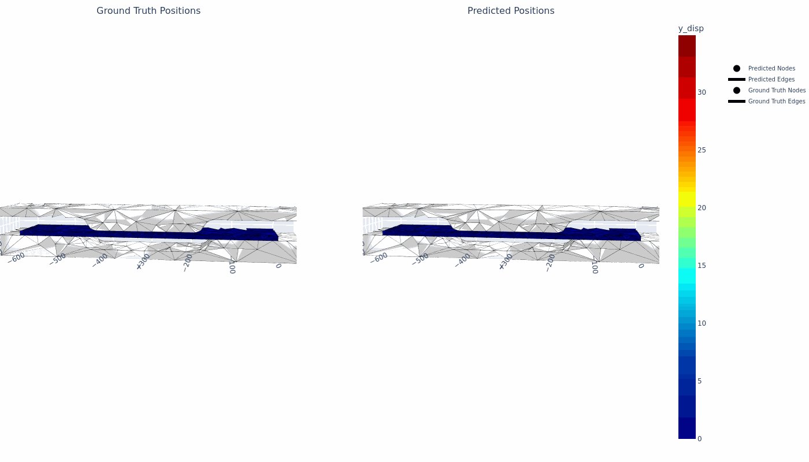
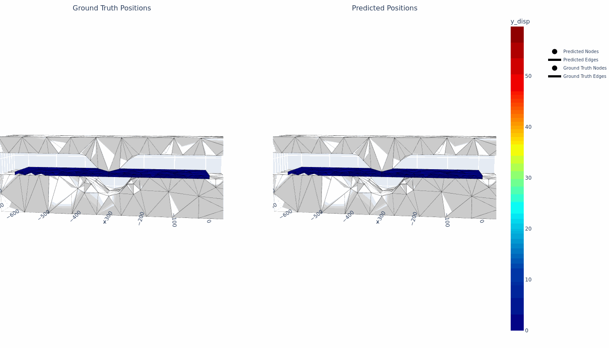

# PressNet

This repo contains/will contain PressNet data and required tools/scripts to use it along with benchmarking code on different surrogate AI models and documents and tutorials related to dataset from generating similar data to exploting the data to its fullest.

## Current Progress
- [x] demo 400 steps structural simulations with coarse mesh
- [x] demo 1500 steps structural simulation with coarse mesh
- [ ] demo 1500 steps structural simulation with medium mesh
- [x] demo 1500 steps structural simulation with fine mesh
- [x] surrogateAI
- [ ] tutorial generating raw data


## PressNet Dataset
The dataset compromises of structural deformation simulation with deformation and stress output for a plate under press forming between two dies. Simulation for 15 different die shapes has been provided and each die shape has 10 variation of their own based on various geometric parameters, making total 150 smulations. Each simulation results will be provided for 1500 time steps, while the simulation it self is of 15 seconds, making individual time step of 0.01s. All the simulation additional is provided with three variations in mesh size, namely coarse, medium and fine. Additionaly, we have also provided the same 150 simulation for 400 time steps and coarse mesh, which was generated for testing purpose.


*Figure: Front view of various die shapes used for the simulation*

## Example Inference 
For proof of concept we have trained for the die shapes using graph network architecture and obtained the following inference.\


*Figure: Inference result of the simulation with deformation seen visually and vertical deformation as contour plot*



*Figure: Inference result of the simulation with deformation seen visually and vertical deformation as contour plot*

## Citation
If you use this dataset in your work, please consider citing the following publications.
```
@inproceedings{PRESSNET2025,
  author    = {Prince Panta and Saroj Belbase and Rachit Rijal and Bipin Shrestha and Nirmal Prasad Panta and Dikshya Parajuli and Rujal Acharya and Saugat Kafley and Amit Regmi and Ken Igeta and Akio Tanaka and Christopher McComb},
  title     = {{PRESSNET: A Forming Dataset for Structural Simulation in Pressed Blanks with Deep Learning Benchmarks}},
  booktitle = {Proceedings of the ASME 2025 International Design Engineering Technical Conferences
               and Computers and Information in Engineering Conference (IDETC/CIE 2025)},
  year      = {2025},
  address   = {Anaheim, CA, USA},
  paperid   = {IDETC2025-163821},
  publisher = {American Society of Mechanical Engineers (ASME)},
  doi       = {10.1115/DETC2025-163821},
  url       = {https://doi.org/10.1115/DETC2025-163821}
}
```
